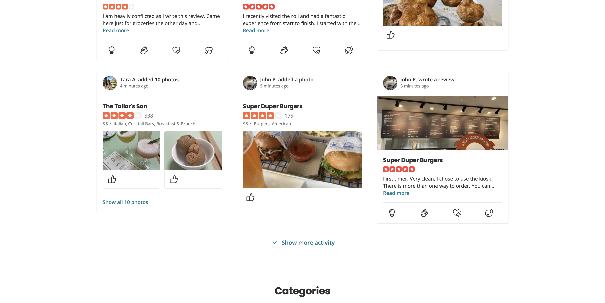
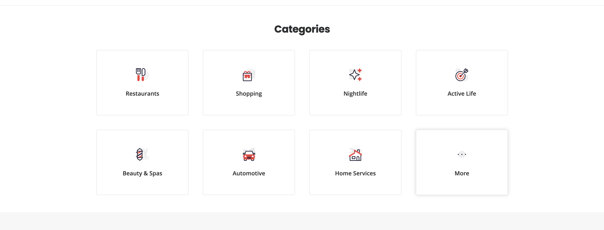
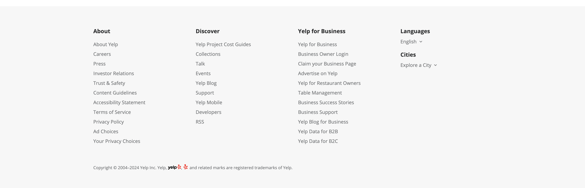

Divided into 4 main sections

# Cycling Image section

    - 4 images with some kind of caption on top of it
    - (Optional) Include button that when clicked it will do a search with the filter for the picture category. (If the picture is of ramen, the button that goes with the picture will do a search for ramen.)
    - (Optional) Try to make the picture take the whole section including the above (so the nav bar is on top of the picture).

# Your Next Review Awaits section

    - (SKIP) Shows when user is logged in Yelp.

# Recent Activity section

    - Looks like each row is occupied by 3 cards (3 columns). They are sorted by review and/or picture posted in reverse chronological order.
    - Recent Activity card: Who posted review/picture on top. Business details in the middle. Review/picture content on bottom.
    - (Optional) Button at the bottom of this section to see more “Show more activity” button.

# Categories section

    - 2 row by 4 column which gives some category suggestions that will search by that category when clicked.

# Footer section

    - We can decide later what to put in there. NOTE: Show on every page, this should be in the Layout?

