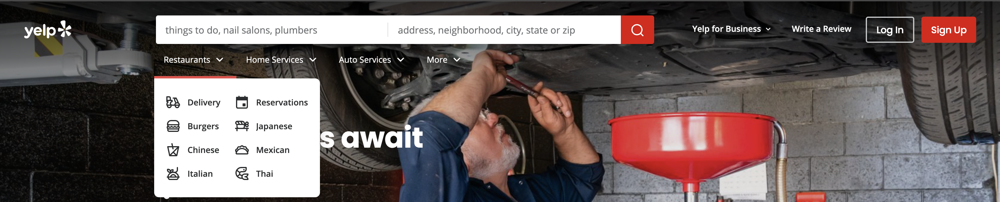
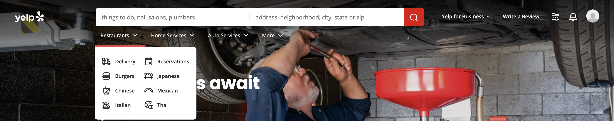
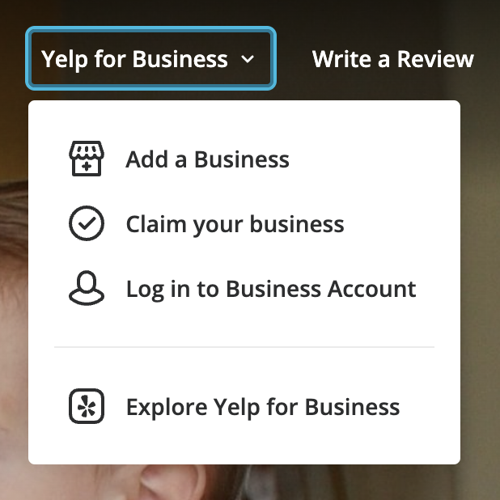
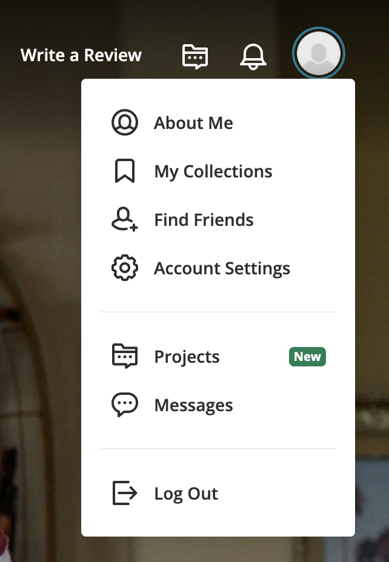
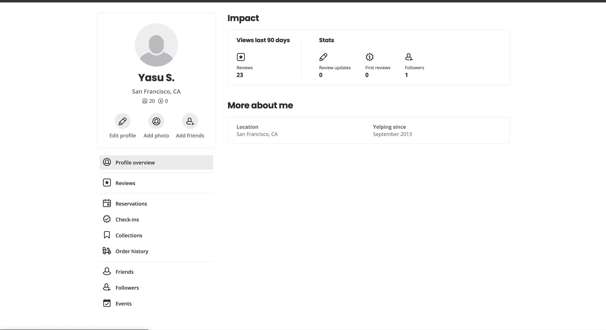
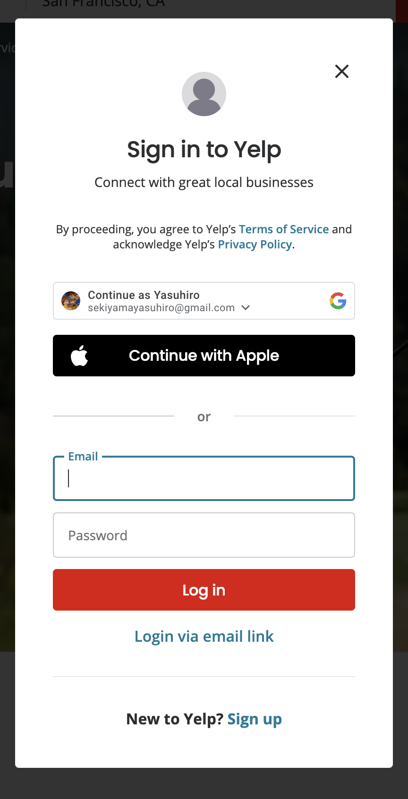
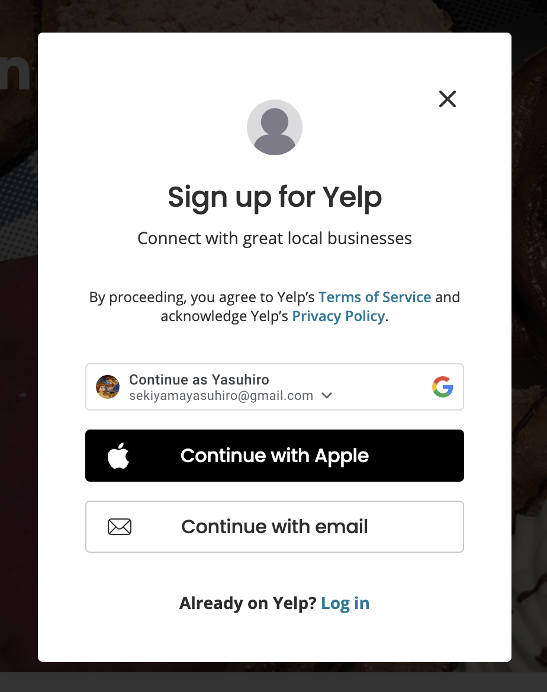

Divided by logged-out user and logged-in user

# Logged-out User

-   Main difference: On the top right, there is a "Log In" button and a "Sign Up" button.
    

# Logged-in User

-   Main difference: On the top right, there is a "Profile" icon, "Notifications" icon, and a "Projects" icon. We can include the "Notifications" and "Projects" icons and on click has a message saying "Feature coming soon!" or we can change the icons leading to something else.
    

# Both

-   The search bar is divided into 2 sections, left for name and categories, right for city, state, and/or zip. We should decide on how we want to implement this. Either we do it similar to the Yelp page or our own.
-   Yelp has 4 dropdown for categories under the search bar. We decided that we will have 2, one for "Restaurants" and one for "More."
-   "Yelp for Business" dropdown should have the link to add and manage business. We are customizing this part to our project.
    
-   "Yelp for Business" as well as "Write a Review" can be modified to redirect the User to log in if not logged in first.
-   "Profile" icon has a dropdown. We can change this drop down to include all the aspects of the "About Me" section of Yelp. We can discuss.
    
    

# Log In / Sign Up

-   We can keep both as a modal with our own customizations.
    
    
