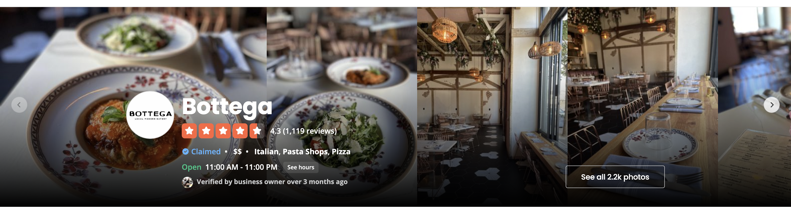
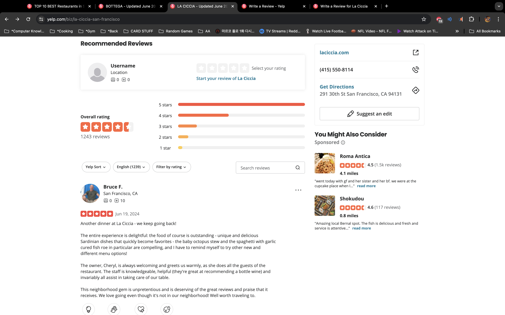

# Business Index

-   Right now our home page is our business index page. We would move it to another page where we can list all of our UNFILTERED businesses. Maybe we can add a button to the navigation bar to go directly here. On Yelp, we need to put in some kind of category in order to get to this page, but we can do it a bit differently.
    
    
-   (Optional) We can try and break down our filter search bar so we can have it on the left. I guess the only thing we will include in there is the price and category? Let's discuss. \*\*\* Discussed that we DO want it this way. Just a matter of thinking HOW???
-   We should make a BusinessIndexCard component with the Yelp style. Thinking of how often the star rating display is used, maybe we can create a reusable component for that as well. We know how to do the basic version from before, but we have not tried implementing half a star box (Look at Bottega). We can also extend this to the rating and the number of reviews to the right of it. We have it partially done, but we are having problems with the props(?).
    -   BusinessIndexCard layout: \*\*\*changed description to recentReviewText
    ```js
    (number)name
    starsDisplay, rating, reviewNumber
    category
    recentReviewText
    ```
-   We can try and implement the Google Maps on the right for the index, but I'm not sure exactly how for this as of now.
-   On the card, you can see the number (1. Bottega) and it shows 1 on the marker on the map. I know how to put the marker, but not sure as of now how to put those together as of now.
-   Google Maps: In short, with the knowledge I have now, incorporating the Google Maps with the BusinessIndex page is hard.

# Business Details

-   Top section: Has a picture along with some business details. There's a button to view all pictures. Pictures button has a pictures length dynamically changing. There's a business logo on the left side which we will omit. I wonder if we can recycle a component here.
    
-   Middle section 1: Has buttons for "Write a Review" and "Add Photo". On the right side has a section for the website, phone number, and address.
    
-   Middle section 2: Has a location and hours. Here we can put in the Google Maps component.
    
-   Middle section 3: We will leave out the "Ameneties and More" and the "Ask the Community" sections. Only have the "About the Business" section here.
    
-   Bottom section: Reviews. Will be discussed in the reviews section. Most important thing is how we want to include the overall rating part. Also if we want to include pagination at the bottom.
    
    
-   I think that can conclude the business details page. There are more things at the bottom, but I don't think we need to include them. Discuss.

# Business CREATE

-   Our own custom form.

# Business UPDATE

-   Our own custom form.

# Business DELETE

-   Our own modal.
-   (Optional) We can be flashy and incorporate a type something to delete.

# Business Management

-   Just like we have now. Instead we should use the BusinessIndexCard component with the buttons next to it.
