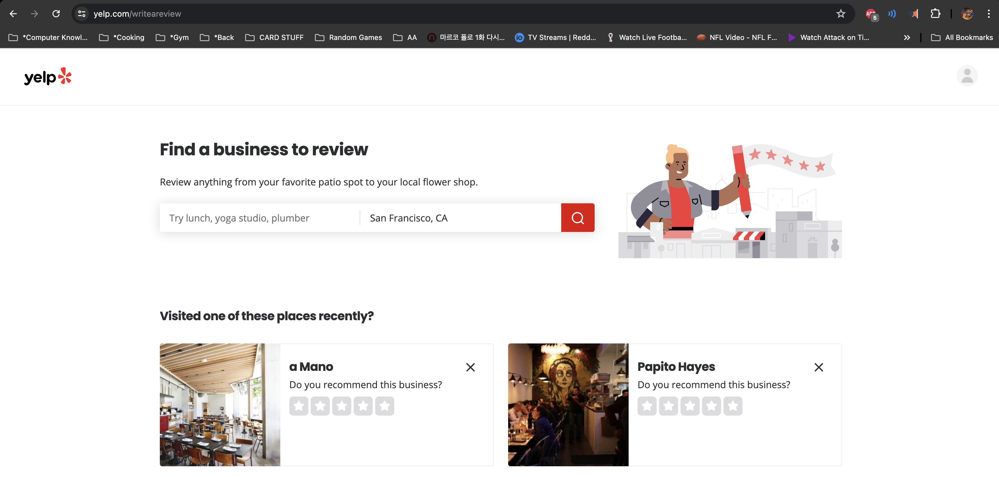
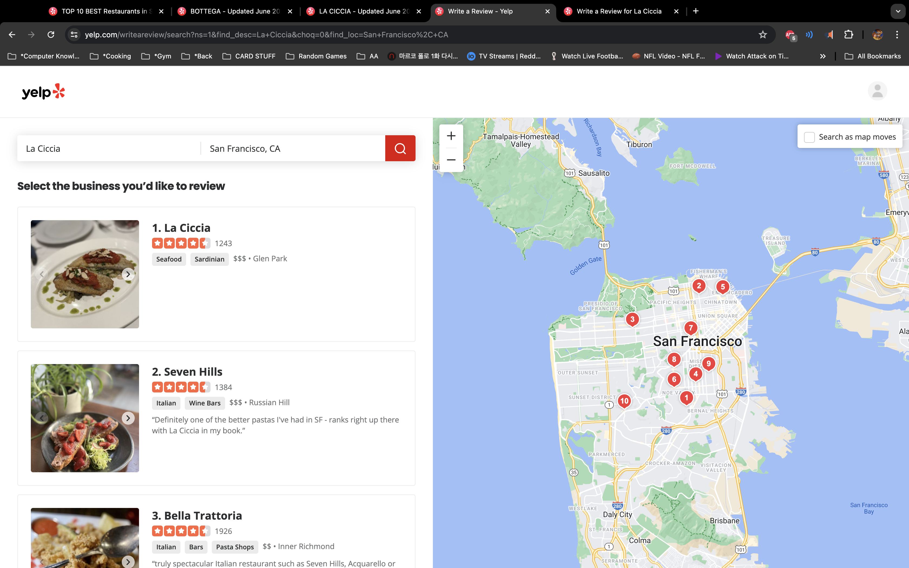
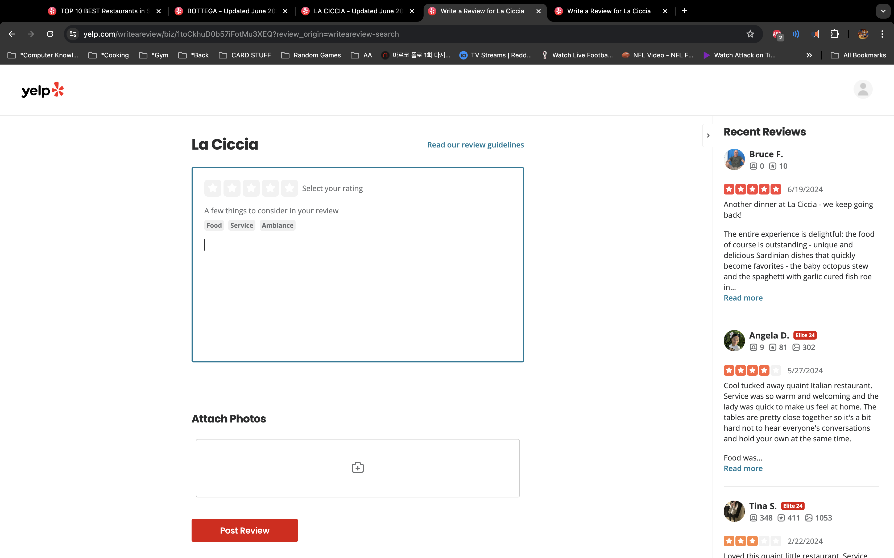
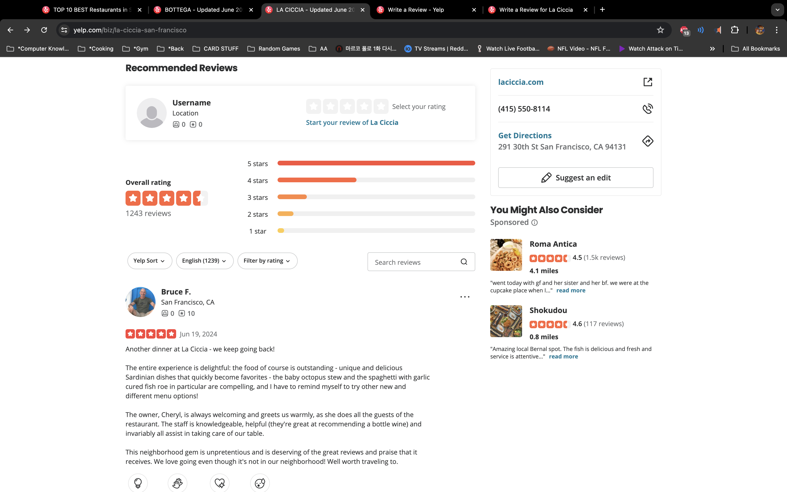
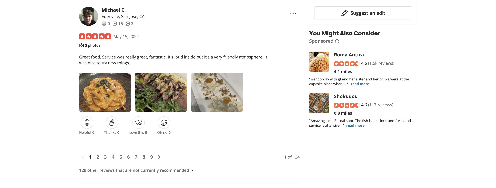
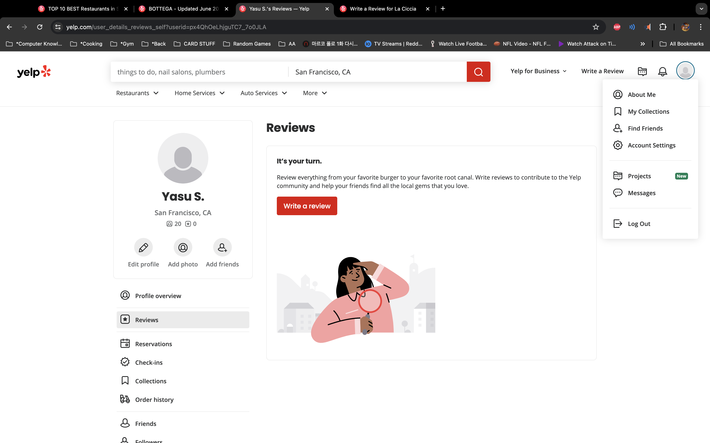

It's a little wierd how Yelp implements the create a review.

# From the Navigation Bar

-   Takes us to a review page where we search for the restaurant. Then there's a list. Then there's the page to actually write the review.
-   For simplicity we probably should discuss how we want to implement things. Maybe we can only hit the write a review from the business details page. \*\*\* Discussed and agreed on the business details page. So what of the nav bar?
    
    
    

# From the BusinessDetails page.

-   Same as the last picture.

# BusinessDetails page Reviews

-   Taken from Businesses section: Most important thing is how we want to include the overall rating part. Also if we want to include pagination at the bottom. \*\*\* INCLUDE PAGINATION. INCLUDE OVERALL RATING. (OPTIONAL) How many star reviews to the right.
    
    

# Overall Impressions

-   We will NOT include the photo section when posting a review for simplicity.
-   How to implement EDIT/DELETE: Not sure how we want to do this part. We can add a button next to the review like we did in the AirBnB project, but if the app scales, we have to think about how hard it will be to find it. So do we want a review management page? Similar to that of the business management page. We can add the link in the profile dropdown. The button for creating a business should not change after a user already created a review because a user can have multiple reviews upon different visits. \*\*\* WE ARE GOING WITH REVIEW MANAGEMENT PAGE AND MAKE IT SIMILAR TO BUSINESS MANAGEMENT PAGE.
    
