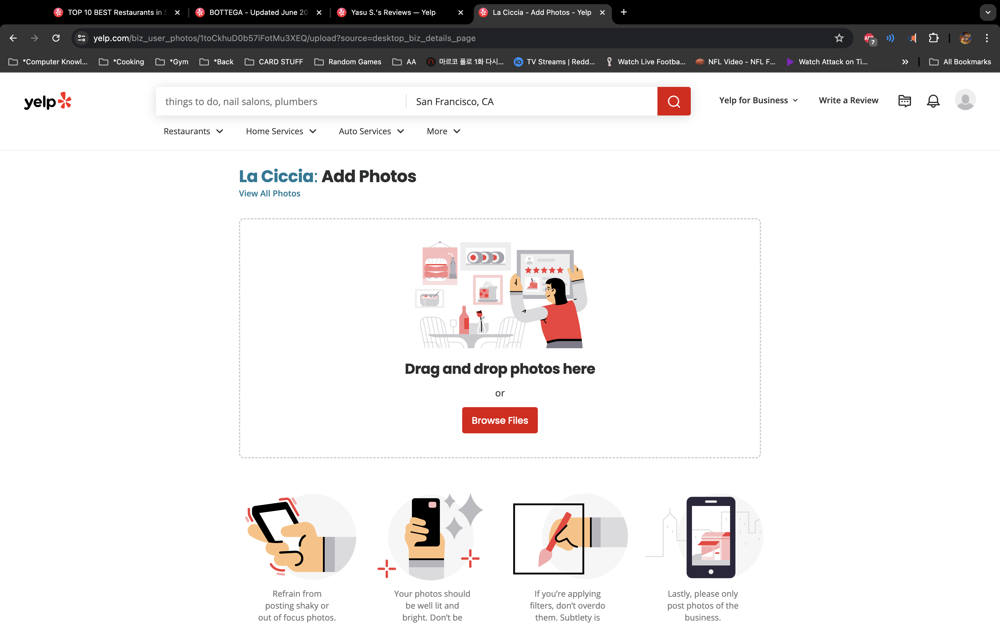
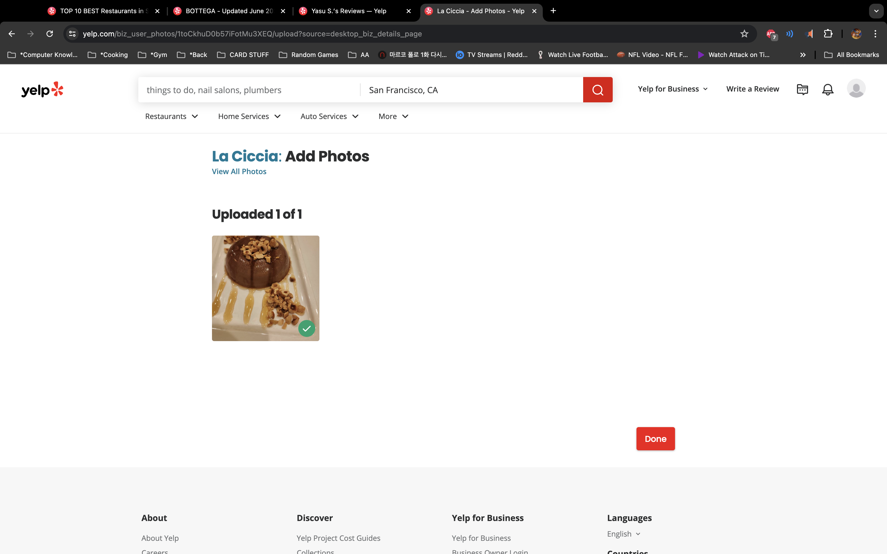
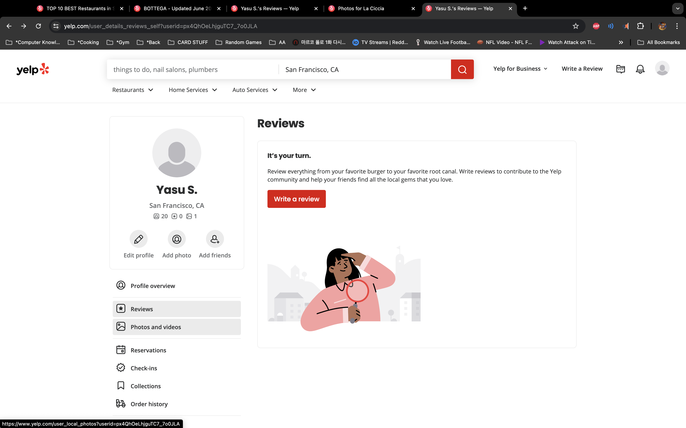
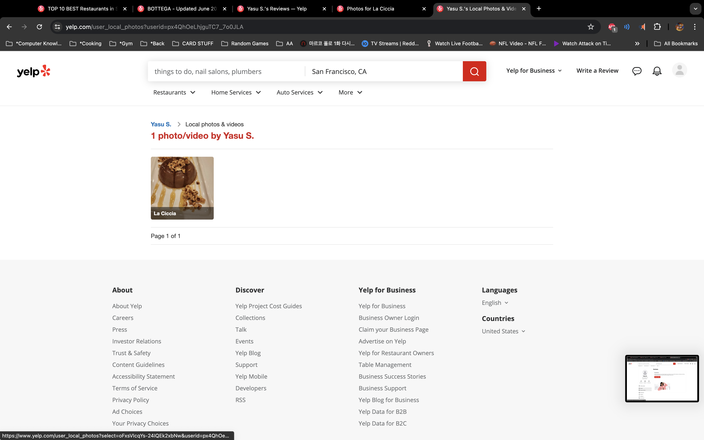
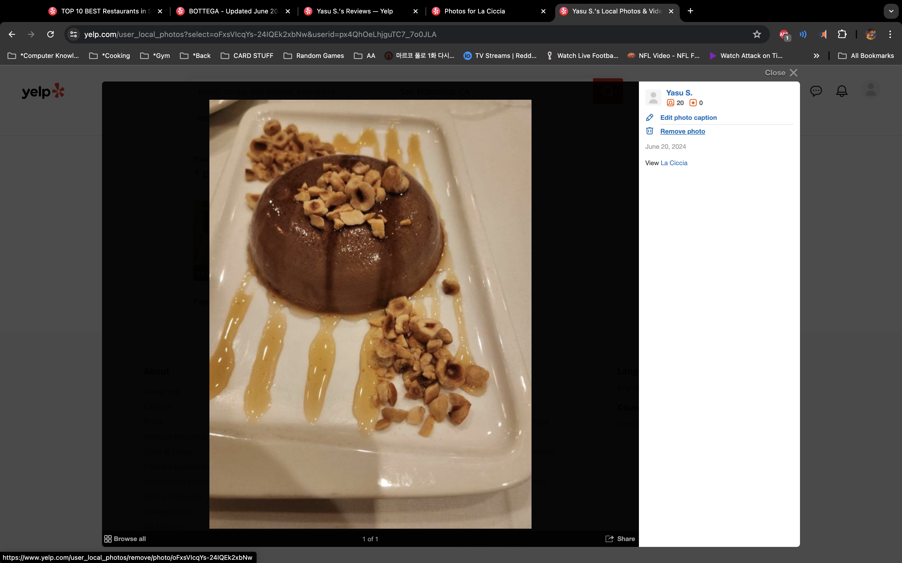
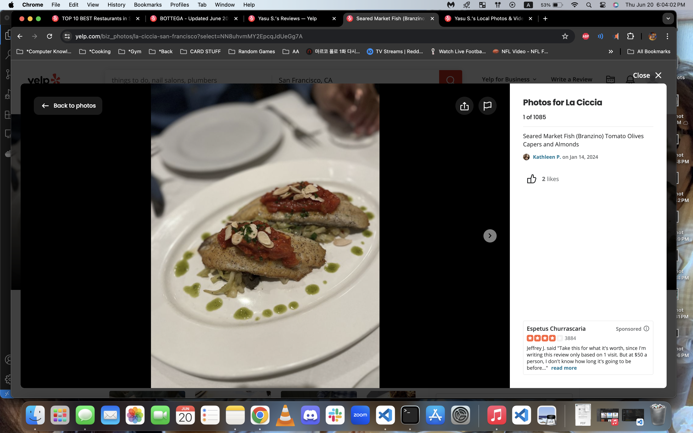

We need to change up how images are uploaded.

# Image Upload Page (Create)

    - There will be a specific page to upload a picture along with a caption. I think we don't have captions implemented, which is fine. We can go without it.

# Image Edit/Delete \*\*\*NO EDIT

    - No captions = no edit. We just need to implement a delete. Yelp's "About Me" page has a section for pictures, maybe we can just add it to the profile button. *** WE WILL DO THAT.

 - This can be like manage business' section but for images?

# View gallery

    - From the business details page we can view the gallery which is a modal. Each row has 5 pictures (5 columns), when an image is clicked, it goes to a bigger one with some details on the right. *** IN BIGGER PICTURE, ON CLICK TO THE NEXT PICTURE IN THE GALLERY FOR THE BUSINESS. (OPTIONAL) INCLUDE THE RIGHT SIDE DETAILS SECTION.

